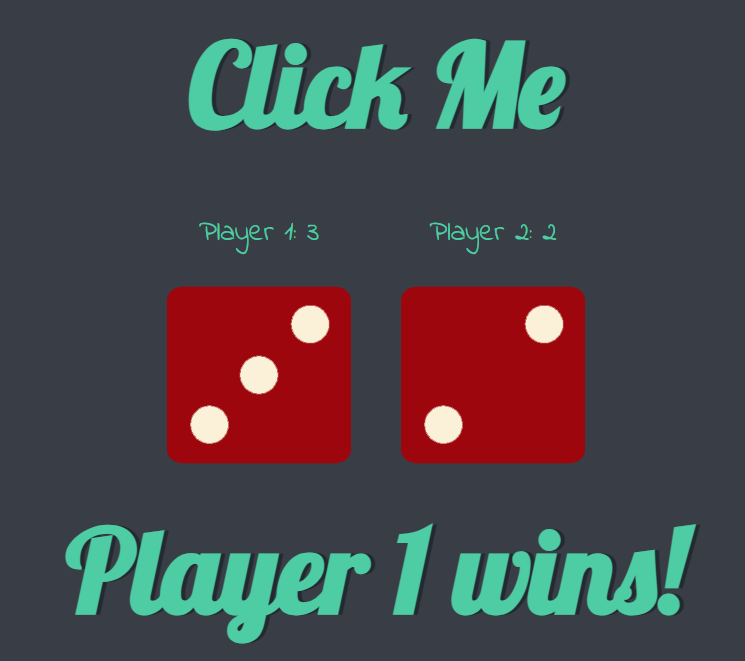

# Dicee Challenge
You can experience the Dicee Challenge in action by clicking [here](https://sufianadnan.github.io/Dicee-Challenge/).



The Dicee Challenge is a simple web application that simulates a dice game for two players. Each player can click the "Click Me" button to roll a virtual six-sided die. The application displays the rolled dice values and announces the winner.


## Table of Contents

- [Introduction](#dicee-challenge)
- [Getting Started](#getting-started)
- [How to Play](#how-to-play)
- [Features](#features)
- [Technologies Used](#technologies-used)
- [Live Demo](#live-demo)

## Getting Started

To run the Dicee Challenge on your local machine, follow these steps:

1. Clone this repository to your computer.

   ```bash
   git clone https://github.com/yourusername/dicee-challenge.git
2. Open the project folder and navigate to the index.html file in your web browser.

3. Click the "Click Me" button to roll the dice and see the result.

# How to Play

To enjoy the Dicee Challenge, follow these simple steps:

- Click the "Click Me" button to roll the dice for both players.
- The dice values and winner will be displayed.
- If one player gets a higher dice value than the other, they win.
- If both players get the same value, it's a draw.

# Features

The Dicee Challenge offers the following features:

- Simulates a two-player dice game.
- Randomly generates dice values for each player.
- Announces the winner or a draw.
- User-friendly and easy to play.

# Technologies Used

The project utilizes the following technologies:

- HTML
- CSS
- JavaScript

# Live Demo

You can experience the Dicee Challenge in action by clicking [here](https://sufianadnan.github.io/Dicee-Challenge/).
